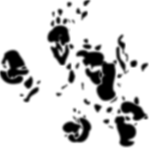

# Willard

Experimental Quantum Programming Language

## Signature

## Concepts
I have used Q# or Qiskit but I felt like it is quite difficult to implement mathematical QC terms into the library's context.
I thinks it is easier to move back and forth, if the programming language itself has more similarity with QC's mathematical
term.

### Video I got my inspire
#### Youtube 
##### Lambda Calculus: PyCon 2019 Tutorial (Screencast)
https://www.youtube.com/watch?v=5C6sv7-eTKg

### The core concepts
Use braket to represent quantum register.

## Compile flow
This compiler is made with Go programming language and transcript *.wld file into the OpenQASM language to execute on the IBM cloud.

